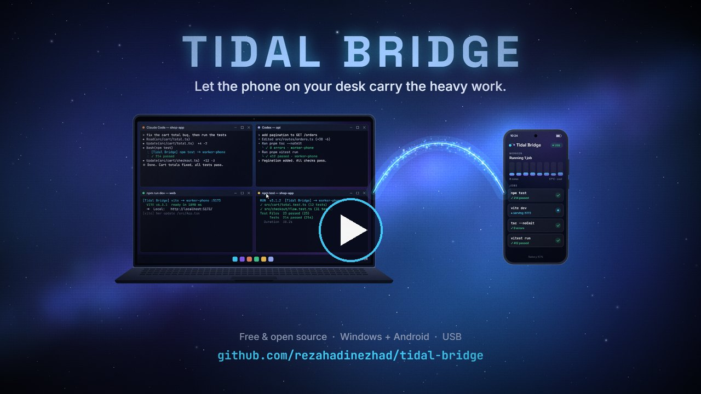

# Tidal Bridge

**Let the phone on your desk run your laptop's tests, type-checks and dev servers.**

[](https://github.com/rezahadinezhad/tidal-bridge/releases/download/v0.2.1/tidal-bridge-intro.mp4)

<p align="center"><sub>▶ The 58-second intro (MP4, sound on)</sub></p>

AI coding agents such as Claude Code and Codex run tests, type-checks, linters and dev servers all day. On a laptop already busy with a browser, Docker and the agents themselves, that means fans, swapping and waiting, while a phone with eight cores and 12 GB of RAM sits idle next to it.

Tidal Bridge connects the two with a USB cable. You and your agents run commands as usual. Tidal Bridge decides for each one whether the phone or the laptop runs it, and the output, exit code and file paths come back exactly as if it had run on the laptop. When the phone is unplugged, hot or busy, everything simply runs on the laptop.

<!-- Dashboard capture goes here: docs/images/dashboard.gif -->

## What it does

- **Moves the right work by itself.** Type-checks, linters, formatters, test suites and dev servers, in every project, with no per-project setup. It weighs the laptop's load, the phone's heat, battery, screen and free memory, and how long each command took on each side before.
- **Keeps results trustworthy.** A doubtful phone failure is re-run on the laptop, and a command the phone gets wrong stays on the laptop. Nothing runs twice by accident.
- **Keeps dev servers alive.** A dev server runs on the phone and answers on its usual `localhost` port; if the phone goes away, it restarts on the laptop.
- **Treats the phone as a phone.** One job at a time while you use it or when it is warm, nothing new when it is hot, and when it gets too hot its running jobs move back to the laptop.
- **Never runs the same thing twice.** A test or check that already ran on the phone with the same files comes back instantly, with the same output.
- **Uses both when there is room.** A long test suite can run half on the laptop and half on the phone at the same time.
- **Shows what it saves.** A local dashboard shows where every command ran and the CPU time and memory the phone took off the laptop.

## Measured

One laptop (Intel i7-10510U, 16 GB, Windows 11) and one phone (Galaxy S23 Ultra, Android 16), on real projects:

| Work | Laptop | Phone | Freed on the laptop |
|---|---:|---:|---|
| Vitest suite, 123 files / 1,097 tests | 123 s | 104 s | the whole run |
| `tsc --noEmit`, warm, Next.js app | 20–38 s | 16–21 s | ~30 CPU-seconds, 1.7 GB peak |
| ESLint, 853 findings | 527 s | 387 s | the whole run |
| Next.js dev server, compiled page | 0.35 s | 0.39 s | the server's memory (~2.9 GB observed) |

- Left to decide on its own over three days of real work, it sent 94 of 100 eligible commands to the phone.
- Its own cost on the laptop is about 18 MB of RAM and no measurable CPU.
- Many commands are slower on the phone than on an idle laptop. The point is a laptop that stays responsive, and Tidal Bridge moves work only when that is worth it.

Two findings along the way: on this phone an ordinary app gets only three of its eight cores, while a process started over USB debugging gets all eight; and Node runs directly on Android, 37% faster than through the usual Linux compatibility layer. See the [benchmarks](docs/BENCHMARKS.md) for method and limits.

## What moves, and what stays

| Moves to the phone | Stays on the laptop |
|---|---|
| Type-checks, linters and formatters (fixes are copied back) | Apps with windows: browsers, editors, Docker Desktop |
| JavaScript and Python test suites | Databases, caches and queues (the phone reaches them on the laptop) |
| Dev servers | Windows-only tools |
| The dependency installs these need, on the phone | Everything, while the phone is unplugged, hot or low on battery |

## Install

You need Windows 10 or 11, PowerShell 7, Python 3.11 or later, and an Android phone (8 GB of RAM or more is best) with **Developer options → USB debugging** turned on. No Termux, Android SDK, root access or administrator rights.

**From a release**, with nothing to compile: download the latest `tidal-bridge-…-windows-x64.zip` from [Releases](https://github.com/rezahadinezhad/tidal-bridge/releases), unzip it and run:

```powershell
pwsh -File scripts\install.ps1
```

**From source** (downloads Go into `.tools` the first time):

```powershell
git clone https://github.com/rezahadinezhad/tidal-bridge.git
cd tidal-bridge
pwsh -File scripts\install.ps1      # build, background service, Claude Code and Codex integration, phone worker
pwsh -File scripts\update.ps1       # later: pull, rebuild, update the phone
```

The installer fetches Android's platform tools if `adb` is missing, waits for you to allow USB debugging on the phone, and sets the phone up; the first time, that downloads Debian, Node and Python tools and takes several minutes. Start a new Claude Code or Codex session afterwards. `pwsh -File scripts\uninstall.ps1 -RemovePhone` removes everything again, including from the phone.

## Use

Nothing changes in how you or your agents work: run commands normally. A line such as `[Tidal Bridge] npm test -> worker-…` on stderr means the phone ran it.

```powershell
.\bin\tidalbridge.exe dashboard    # where commands ran and what the phone saved
.\bin\tidalbridge.exe status
.\bin\tidalbridge.exe doctor       # explains anything that is not working
```

To keep work on the laptop, press **Pause** in the dashboard or list a project under **Never offloaded**.

## Safety and privacy

- Nothing leaves your desk. There is no cloud service, account or API key; the laptop and the phone talk over the USB cable only.
- USB debugging gives the laptop shell access to the phone. The phone worker runs as Android's `shell` user, not inside an app sandbox, and can read the phone's shared storage such as photos and downloads. Use a phone you trust with your code, and read the [security boundaries](SECURITY.md).
- `.env` files reach the phone only for projects you allow; key and credential files never do.
- Project copies on the phone live in `/data/local/tmp/tidalbridge`; copies unused for two weeks are removed.

## Limits

- Windows laptops and Android phones only for now. macOS and Linux hosts build but have no background service yet.
- Tested on one phone so far. Others should work, and reports are very welcome.
- A phone has no fan and suits bursts. Long, heavy suites make it hot, and then work moves back to the laptop.

## Tested phones

| Phone | Android | RAM | Status |
|---|---|---|---|
| Samsung Galaxy S23 Ultra (SM-S918B) | 16 | 12 GB | In daily use |

Tried it on another phone? Please [file a device report](../../issues/new?template=device-report.yml); it takes two minutes and helps everyone.

## Documentation

- [Setup and lifecycle](docs/SETUP.md)
- [Architecture and protocol](docs/ARCHITECTURE.md)
- [Scheduling policy](docs/SCHEDULER_POLICY.md)
- [Device profiles and several devices](docs/DEVICE_PROFILES.md)
- [Codex and Claude integration](docs/AGENT_INTEGRATION.md)
- [Security boundaries](SECURITY.md)
- [Troubleshooting](docs/TROUBLESHOOTING.md)
- [Benchmarks](docs/BENCHMARKS.md)
- [Roadmap](docs/ROADMAP.md)

## Development

```powershell
.\scripts\build.ps1                       # build, swap binaries, restart the service (refuses while jobs run)
.\.tools\go\bin\go.exe test ./...
python tests/e2e/run.py
python -m unittest discover -s tests/worker
python scripts/install-adb-worker.py --skip-provision   # push worker changes to the phone
```

The Go bootstrap verifies the official distribution's checksum and keeps the toolchain under `.tools`.

## License

[MIT](LICENSE)
