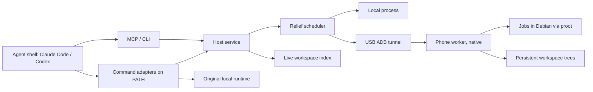

# Architecture and protocol

The Go executable provides the host service, the CLI and a stdio MCP server. The long-lived host owns discovery, admission, routing, synchronization, attempts, telemetry and result collection. The phone runs a dependency-free Python worker. The browser dashboard opens on demand; there is no permanent UI process.

## Host

`tidalbridge-service.exe` runs as the per-user Task Scheduler task "Tidal Bridge Host" (logon trigger, restart on failure, no time limit, no administrator rights). State is in `%USERPROFILE%\.tidalbridge`: packaged apps such as Claude and Codex virtualize AppData and HKCU writes from their child processes, so state there would split into private copies. `TIDALBRIDGE_DATA_DIR` or `--data-dir` selects another instance. Earlier AppData state is migrated on first start.

The service starts the ADB server itself (a server started from an agent session dies with it and drops every forward), follows `adb track-devices`, and refreshes workers at least once a minute. Battery and thermal state are probed every two minutes (30 seconds while busy). A failed `adb devices` call keeps the last known states unless it fails three times in a row.

## Workers

**ADB-shell worker** (`scripts/install-adb-worker.py`). Android keeps app processes such as Termux on the efficiency cores and lets the low-memory killer reclaim them; processes started through `adb shell` may use every core and have `oom_score_adj -1000`. The worker runs as the shell user from `/data/local/tmp/tidalbridge`:

- It runs natively, using the userland's Python through glibc's dynamic loader. Its own file work (sync, logs, accounting) is not traced.
- Every job runs in the Debian userland through `proot` with only the worker directory bound in. `proot` costs about half a millisecond per traced file-system call, so keeping the worker outside it made a no-change sync of 2,620 files drop from 15 s to 0.4 s.
- Node tools can run without `proot` (`engine: native`, the default for detected commands and Debian task-file tasks; `engine: proot` opts a task out). The worker keeps a copy of the userland's Node whose glibc loader path is rewritten to a short link (`/data/local/tmp/tb/ld`), so Node and every child Node it starts run directly with `LD_LIBRARY_PATH` set to the userland's libraries. A package script qualifies when it is a single Node program without shell features; anything else, and every install, runs under `proot`. Native jobs may use every core: nothing traces them, and Node then reports one CPU count through all of its APIs (Vitest compares them). Native runs resolve only loopback names (Android has no `/etc/resolv.conf`).
- It pins itself, and so every job, to the cores outside the slowest cluster. Android's energy-aware scheduler otherwise places `proot`'s mostly waiting tracer on efficiency cores, and every traced call waits for one.
- `proot` is Termux's build, copied out of Termux and with its built-in Termux paths rewritten to the worker directory: the shell user cannot enter Termux's private data, where the original looks for its loader.

The host starts this worker with `adb shell sh /data/local/tmp/tidalbridge/start-worker.sh` when it does not answer. The script detects a running worker by command line, so it is idempotent.

**Termux worker** (`scripts/onboard-device.py`). The original executor: Termux's Python and Node, with an optional Debian runtime through `proot`. It works on any non-rooted phone but runs on efficiency cores. One worker is approved per phone serial.

## Protocol version 1

Host and worker speak bounded JSON over loopback HTTP with independent bearer secrets, through `adb forward`. Worker identity is a persistent random ID, separate from the serial. Capabilities contain architecture, runtime versions (`debian-*` for the userland), resources, features and calibration. The host rejects identity, protocol and mock-designation mismatches.

Worker endpoints: `/v1/capabilities`, `/v1/calibrate`, `/v1/sync/missing`, `/v1/sync/apply`, `/v1/environments/status`, content-addressed blob upload, `/v1/jobs` with status, cancellation, output and artifacts. Host endpoints add `/v1/status`, `/v1/explain`, `/v1/events`, `/v1/automation`, local and adapter observations, settings, refresh and per-device drain. The source of truth is `packages/protocol/types.go`.

A job is an exact argument array with a host workspace, a workspace-relative working directory, requirements, timeout, environment overrides, declared outputs and policy. `runtime: debian` runs it in the userland. A `service` job (a dev server) runs until its client stops polling, with `ports` served on the laptop through `adb forward` and `reverse_ports` (laptop services such as an API on 8000) reachable from the job through `adb reverse`.

## Workspaces

The host keeps a live index per workspace: one scan (with a persistent hash cache), then file-system notifications (`ReadDirectoryChangesW`), so routing a command does not rescan the project. Watching starts before the scan, so an edit made during the scan is not lost. Version-control metadata, dependency directories, build output, logs, Rust `target` directories, files over 256 MB, credentials and keys are excluded; `.env` files only when the project opts in (`sync_env_files`). Nested `.gitignore` files apply in projects without git. `.tidalbridgeignore` is applied after every `.gitignore`, so `!dir/` brings back generated files a job needs.

The worker keeps a persistent tree per workspace (`state/trees/ws-…`). A sync uploads missing content (six requests in flight), then applies the manifest: changed files are written, files that left the manifest are removed, and a synced file a job modified is restored. Files jobs create (dependencies, caches, build output) are never touched. Locked dependencies are installed inside the tree when the lockfile changes (`npm ci`, `uv sync --frozen`, or a pip virtual environment), in the background when a command first finds them cold. A running service receives edits as they happen.

A write-back job lists, before it reports its exit code, the synced files it changed or deleted and the files it created outside dependency and cache directories; their content goes into the worker's blob cache. The host checks every changed or deleted file still holds the content the job started from, and every created file is new and a synced path. Only then does it download all content, verify each hash and move the files into place; otherwise nothing is applied and the adapter runs the command locally.

Output streams back with the worker's tree path replaced by the laptop path, so file references in compiler, linter and test output open on Windows.

## Attempts and failure handling

Attempts have IDs, targets, timestamps, transfer and sync measurements, CPU and peak memory of the whole process tree on both sides, and errors. Terminal states are COMPLETED, FAILED, CANCELLED, INTERRUPTED and REJECTED. If the USB tunnel breaks, the host repairs it and keeps polling for 90 seconds (6 seconds for replay-safe work with a local fallback). A job that may have been accepted is never started again locally after a polling error. A forced-remote job waits up to 15 seconds for a recovering worker, then is rejected. A host restart marks unfinished jobs INTERRUPTED and never replays them. On the phone, a run past its time limit that is still printing keeps going, because a slow phone is not a hung job; it stops after ten minutes without output or at three times its limit, and is never moved back to the laptop. Records are atomically replaced JSON files.

The dashboard shows what the phone spares the laptop. A phone job's saving is the command's measured cost on the laptop, when it has completed there before. Otherwise it is the phone's own measurement, marked ≈.
- The laptop costs are averages of the last few successful local runs. They are kept in `laptop-costs.json`, apart from the rolling routing history.
- While jobs run, every poll of the worker also reads its current memory and processor load. The dashboard draws dashed "without the phone" lines on the laptop charts. Those lines add that load, using the command's laptop rate when known.
- Not counted as savings: phone setup jobs, evacuated jobs, write-back conflicts, and failures the laptop re-checked.

The phone keeps a copy of each project it works on, with that project's dependencies.
- Copies and cached file content unused for two weeks are removed. When free storage drops below 5% (at least 3 GB), copies unused for an hour go too, least recently used first.
- Anything a queued or running job uses is never removed.
- A copy is moved aside under its lock before deletion, so the next sync starts from an empty copy.
- Content the laptop assumed present is sent again.

## Bounds

Admission queue 64; execution slots 4; local slots 1; worker slots up to 3 by default, adaptive (see the scheduler policy), plus up to 4 services; the worker itself accepts up to 8, so the host decides. Output streams are bounded to 64 MB. Workers keep the newest 200 job directories. Manifests are bounded to 100,000 files. Test runners under `proot` get `VITEST_MAX_WORKERS=2` unless set, since vitest gives a worker 60 seconds to start.

## Browser adapter

The host probes Chrome's debugging socket through ADB, creates an owned target through the CDP Target domain, applies viewport and DPR, waits for readiness and captures a PNG plus console, network and DOM metadata. It forwards only explicitly supplied loopback development URLs and removes its mappings afterward. Captures use the real Android renderer and are not Windows desktop fidelity. Chrome must stay responsive and in the foreground on the tested phone.

See the [runtime decision](decisions/001-runtime.md) and [remaining work](ROADMAP.md).
